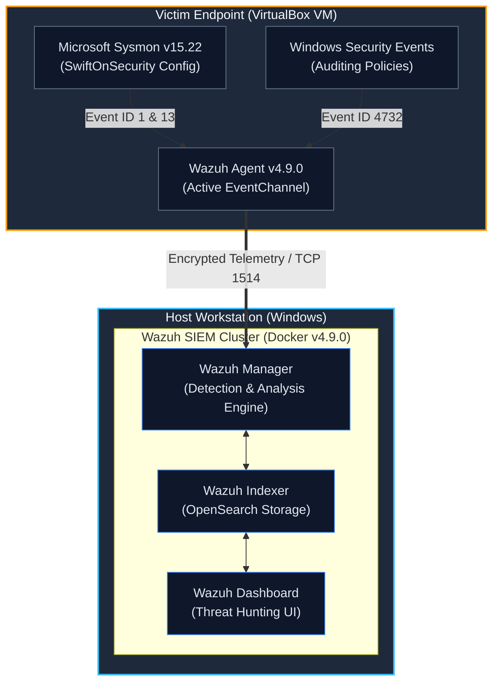

# Enterprise Detection Engineering & Incident Triage Lab
**Adversary Emulation | Telemetry Pipeline | MITRE ATT&CK Mapping | Detection-as-Code**

---

## Executive Overview
This laboratory implements an end-to-end Blue Team detection pipeline designed to emulate adversary behaviors, extract granular host telemetry via **Microsoft Sysmon**, and build enterprise detection rules within a containerized **Wazuh SIEM/XDR** cluster. 

The primary objective is to demonstrate hands-on competencies in:
- **Host Telemetry Engineering**: Deploying Sysmon with customized audit schemas (SwiftOnSecurity configuration) alongside native Windows Security Auditing.
- **Threat Detection Engineering**: Designing platform-agnostic **Sigma Rules** and converting them into production **Wazuh XML Analysis Rules**.
- **Adversary Emulation**: Executing targeted MITRE ATT&CK techniques (Execution, Persistence, Privilege Escalation).
- **SOC Incident Triage**: Analyzing raw telemetry (`Event ID 1`, `Event ID 13`, `Event ID 4732`), evaluating process lineages, inspecting command-line obfuscations, and defining standard triage playbooks.

---

## Architecture & Topology

## Architecture & Topology


---

## MITRE ATT&CK Coverage Matrix

| Tactic | Technique ID | Technique Name | Data Source / Artifact | Severity |
| :--- | :--- | :--- | :--- | :--- |
| **Execution** | [T1059.001](https://attack.mitre.org/techniques/T1059/001/) | PowerShell: Encoded Execution & Policy Bypass | Sysmon Event ID 1 (Process Creation) | **Critical (Level 12)** |
| **Persistence** | [T1547.001](https://attack.mitre.org/techniques/T1547/001/) | Boot/Logon Autostart: Registry Run Keys | Sysmon Event ID 13 (Value Set) | **High (Level 10)** |
| **Privilege Escalation** | [T1098](https://attack.mitre.org/techniques/T1098/) | Account Manipulation: Local Administrators Group | Windows Security Event ID 4732 | **Critical (Level 12)** |

---

## Adversary Emulation & Detections

### 1. Obfuscated PowerShell Execution (T1059.001)
- **Emulated Command**:
  ```powershell
  powershell.exe -ExecutionPolicy Bypass -NoProfile -EncodedCommand SQBFAFgAIAAoACcAVABlAHMAdAAnACkA


Detection Logic: Evaluates process creation events where Image matches PowerShell instances and CommandLine contains execution policy bypass flags combined with encoded execution switches (-enc, -encodedcommand).

Telemetry Breakdown:

ProcessId, ParentProcessId, and ParentImage inspection.

Base64 payload decoding (IEX ('Test')).

SHA-256 process hashing for artifact validation.

2. Registry Persistence via Run Key (T1547.001)
Emulated Command:

DOS
reg add "HKCU\Software\Microsoft\Windows\CurrentVersion\Run" /v "SOC_Malware_Test" /t REG_SZ /d "C:\Users\Public\svchost_fake.exe" /f

Detection Logic: Monitors Sysmon Event 13 specifically targeted at registry keys under \Software\Microsoft\Windows\CurrentVersion\Run* establishing persistence outside normal software installations.

Telemetry Triage & Evidence

1. Alert Aggregation & Correlation
The Wazuh Manager ingests real-time events, firing high-severity correlation rules against the endpoint activity:

2. T1059.001 Deep Dive (Sysmon Event ID 1)
Granular investigation into the process execution tree, revealing parent-child lineage and command-line arguments:

3. T1547.001 Deep Dive (Sysmon Event ID 13)
Inspection of registry modification targeting auto-run persistence:

4. Attack Timeline & Incident Scope
Complete event chronological sequence illustrating initial drop, persistence, and execution triggers:

Repository Structure
SOC-Detection-Lab/
├── README.md  # Lab architecture and detection documentation
├── detections/
│   ├── proc_creation_win_powershell_obfuscated_exec.yml # Generic Sigma Rule (T1059.001)
│   ├── registry_set_run_key_persistence.yml           # Generic Sigma Rule (T1547.001)
│   └── wazuh_rules.xml   # Production Wazuh XML Detection Rules
├── playbooks/
│   └── IR-Playbook-T1059.001.md # SOC Tier-1/Tier-2 Incident Response Playbook
└── evidence/
    ├── 01_wazuh_attack_alerts_summary.png # Overview of alert hits in Wazuh
    ├── 02_triage_powershell_telemetry_t1059.png # Sysmon Event ID 1 field analysis
    ├── 03_triage_registry_persistence_t1547.png # Sysmon Event ID 13 registry telemetry
    └── 04_soc_incident_attack_timeline.png # Multi-stage attack progression

How to Replicate
Deploy SIEM Cluster:

Bash
git clone [https://github.com/wazuh/wazuh-docker.git](https://github.com/wazuh/wazuh-docker.git) -b v4.9.0 --single-branch
cd wazuh-docker/single-node
docker compose up -d
Provision Endpoint:

Install Windows 10/11 Pro on VirtualBox configured with a Bridged Network Adapter.

Install Sysmon: Sysmon64.exe -accepteula -i sysmonconfig-export.xml.

Install Wazuh Windows Agent and add the Sysmon channel to ossec.conf:

XML
<localfile>
  <location>Microsoft-Windows-Sysmon/Operational</location>
  <log_format>eventchannel</log_format>
</localfile>
Deploy Custom Detections:

Import detections/wazuh_rules.xml into /var/ossec/etc/rules/local_rules.xml.

Restart the Wazuh Manager: docker exec -it single-node-wazuh.manager-1 /var/ossec/bin/wazuh-control restart.

Execute Adversary Actions & Validate:

Run test commands on the VM.

Inspect alerts in Wazuh Dashboard via Threat Hunting -> Events.
